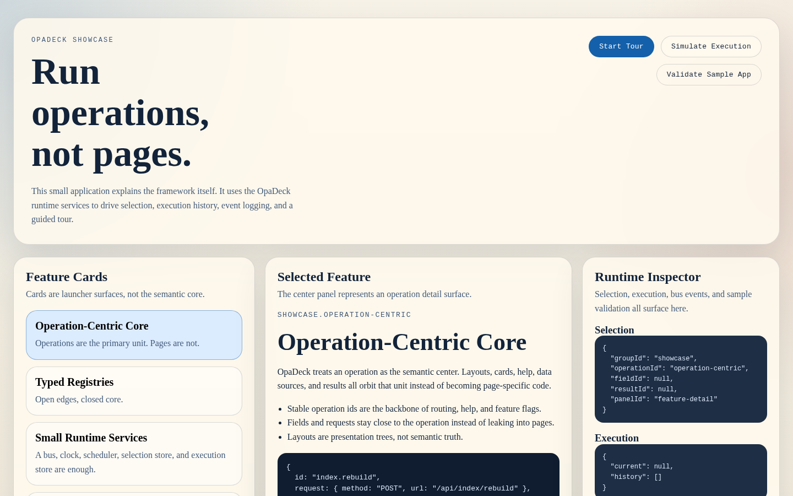
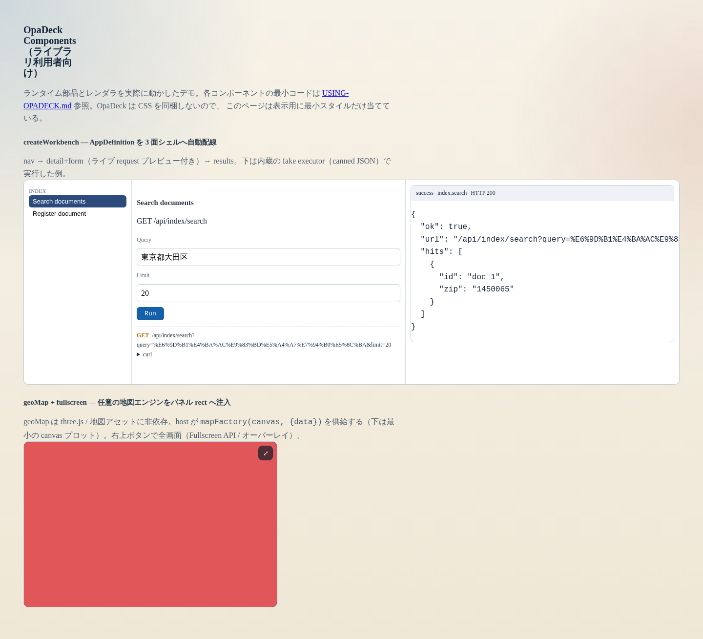
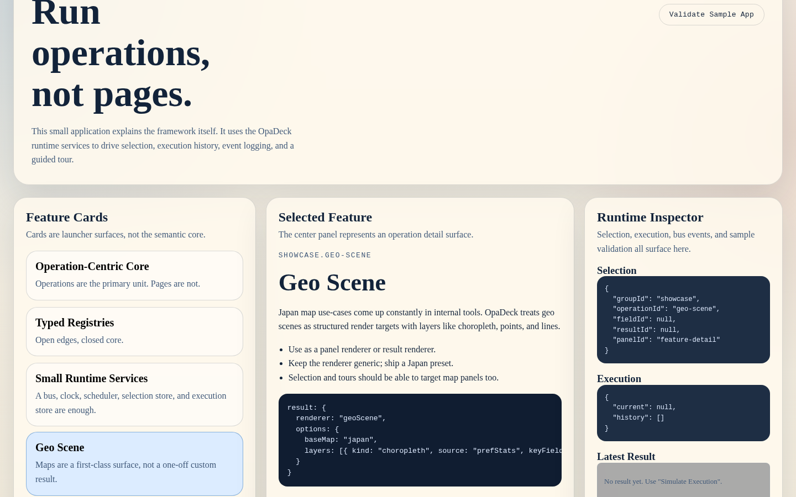
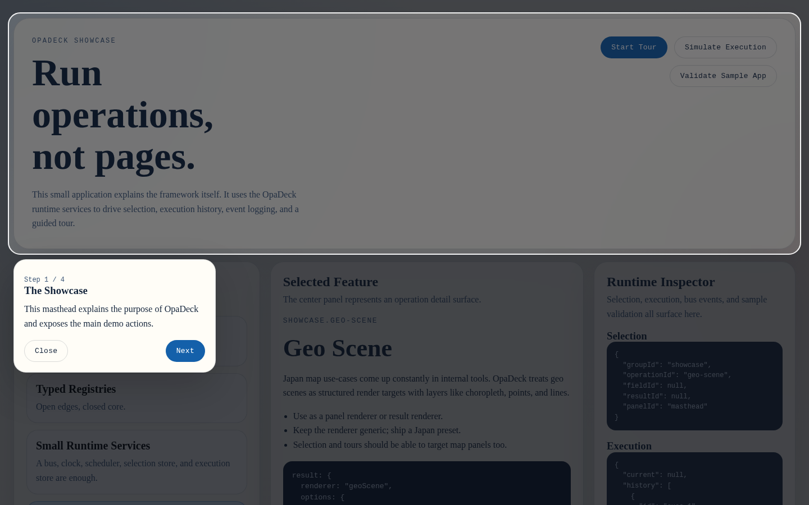

# Using OpaDeck — ライブラリ利用者ガイド

OpaDeck を自分のアプリに組み込む人向けの実践ガイド。各部品の**見た目**（スクリーンショット）と
**最小の組み立てコード**をまとめる。OpaDeck は依存なしの素の ESM で、CSS も同梱しない
（見た目は利用側が当てる）。

> スクリーンショットは `showcase/capture-screenshots.mjs`（repo を Node http で配信 + Playwright）で
> 再生成できる（外部依存なし）。末尾参照。

## 取り込み

`src/*` をそのまま import する（npm 未公開なので vendoring か submodule）。

```js
import {
  createRuntimeBus, createSystemClock, createScheduler,
  createSelectionStore, createExecutionStore,
  createFieldRendererRegistry, createResultRendererRegistry, registerBuiltinRenderers,
  createHttpExecutor, buildRequestPreview,
  createWorkbench, createGeoMapPanelRenderer, makeFullscreenable,
  createTourRuntime, createDefaultTourCommandHandlers, createTourCommandHandlerRegistry, createDefaultTourOverlay,
  renderGeoScene, validateAppDefinition, compileOpsui,
} from './opadeck/index.js';
```

---

## 1. ランタイムサービス

bus / clock / scheduler / selection / execution の小さな部品群。状態は明示的なストアに置く。

```js
const bus = createRuntimeBus();
const clock = createSystemClock();                 // テストは createManualClock()
const scheduler = createScheduler({ clock });
const selection = createSelectionStore({ bus });
const executions = createExecutionStore({ bus, clock, historyLimit: 200 });
bus.subscribe('execution.success', (e) => console.log('done', e.record.operationFqid));
```

---

## 2. リクエストビルダ + HTTP 実行

operation 定義 + 入力状態を `RequestPreviewModel`（URL / headers / body / curl）へ直列化し、
注入した `fetch` で実行する。送信前にプレビューを見せられる。

```js
const op = {
  id: 'search', groupId: 'index',
  request: { method: 'GET', url: '/api/index/search' },
  fields: [{ id: 'q', name: 'query', type: 'text', placement: 'query' }],
};
buildRequestPreview(op, { q: '東京都' }).url;   // "/api/index/search?query=東京都"

const executor = createHttpExecutor({ executions, clock, fetch: window.fetch.bind(window), baseUrl: '/' });
await executor.execute(op, { q: '東京都' });     // 結果は executions に入り execution.* が飛ぶ
```

- **body kind**: `none` / `rawField`（1 フィールドを生 body）/ `form`（urlencoded）/ `multipart`（固定境界）。
- **checkbox**: `field.checkedValue` / `uncheckedValue` で HTML 意味論。未チェックは送信されない。
- **ストリーミング**: `createHttpExecutor({ ..., onProgress })` で NDJSON/JSON Lines を逐次受信
  （ストアは begin→succeed のまま、`onProgress(partial)` で途中描画）。

---

## 3. ビルトインレンダラ

field（text/textarea/checkbox/select/json）、result（jsonFoldable/tableResult/jsonLines/text/inlineSvg/
timeSeries/geoScene）、panel（groupNav/operationTiles/operationDetail/resultStack）を一括登録。

```js
const fieldRenderers = createFieldRendererRegistry();
const resultRenderers = createResultRendererRegistry();
registerBuiltinRenderers({ fieldRenderers, resultRenderers });
const r = resultRenderers.match({ bodyJson, contentType });  // ctx に合うレンダラ
container.appendChild(r.render({ document, bodyJson, contentType }));
```

下のショーケースは運用モデル・レンダラ・ランタイムインスペクタを実演している：



---

## 4. createWorkbench — AppDefinition を 3 面シェルへ

nav → detail+フォーム（ライブ request プレビュー付き）→ results を自動配線する高レベル API。
ビルトインの panel/field レンダラ・operation ごとの入力状態・実行購読を手で組まなくてよい。

```js
const workbench = createWorkbench({
  document, app,                                   // 正規化済み AppDefinition
  mounts: { nav, detail, results },                // 3 つの DOM 要素
  executor, executions, selection, baseUrl: '/',
  // renderResult / filterMatch で結果カードや絞り込みを差し替え可
});
workbench.selectOperation('index.search');
```



（上の左側が createWorkbench、右下が次の geoMap）

---

## 5. geoMap + fullscreen — 地図エンジンをパネルへ注入

`geoMap` はパネル/結果サーフェスの任意 rect に**地図エンジンを差し込む**レンダラ。コアは
three.js も地図アセットも知らない。host が `mapFactory(canvas, { data, onPick })` を供給する。
全画面ボタンを内蔵（Fullscreen API、未対応時は CSS オーバーレイ）。

```js
const geoMap = createGeoMapPanelRenderer({
  mapFactory: (canvas, { data, onPick }) => myMapEngine(canvas, data, onPick), // 返り値は {resize?,refresh?,destroy?}
});
panel.appendChild(geoMap.render({ document, data, panelId: 'map' }));

// 任意要素を単体で全画面化することも:
const fs = makeFullscreenable(panelEl, { onChange: (on) => renderer.resize() });
```

> vacant-service ではこの `geoMap` に tetsugo の地図エンジン（2D canvas / 3D 地形）を注入して
> エラー住所マップを埋め込んでいる。

---

## 6. geoScene — 日本地図(SVG・データ駆動)

choropleth / points / lines を持つ汎用 SVG 地図。result/panel どちらのサーフェスでも使える。

```js
const svg = renderGeoScene({ document, scene: { baseMap: 'japan', layers: [
  { kind: 'choropleth', source: 'prefStats', keyField: 'pref', valueField: 'count' },
] }, data: { prefStats: [{ pref: 13, count: 92 }] }, onSelect: (code) => {} });
```



---

## 7. ガイドツアー

ステップ（focus 対象 + ナレーション）を宣言し、スポットライト + カードで案内する。
`focusOperation` / `focusField` / `focusPanel` に加え、任意 CSS を狙う **`focusSelector`** がある。

```js
const handlers = createTourCommandHandlerRegistry().registerAll(createDefaultTourCommandHandlers());
const overlay = createDefaultTourOverlay({ document, root: document.getElementById('tour-root') });
const tour = createTourRuntime({ bus, selection, scheduler, executions, handlers, overlay });
tour.play({ id: 'intro', steps: [
  { id: 's1', title: '操作一覧', narration: 'ここから選びます', commands: [{ kind: 'focusPanel', panelId: 'nav' }] },
  { id: 's2', title: '地図', narration: '結果は地図でも', commands: [{ kind: 'focusSelector', selector: '.opa-result-toolbar' }] },
] });
```



---

## 8. `.opsui` DSL（任意）

operation を JS オブジェクトでなく DSL で書ける（layout/help/tour ブロックは未対応）。

```js
const { app, problems } = compileOpsui(opsuiSource);  // 正規化 + validateAppDefinition
```

---

## スクリーンショットの再生成

```bash
node showcase/capture-screenshots.mjs   # → docs/en/img/*.png
```

repo root を Node http で配信し（showcase が `../src/index.js` を import するため）、Playwright で
showcase 本体（`showcase/index.html`）と新コンポーネントのデモ（`showcase/components.html`）を撮影する。
